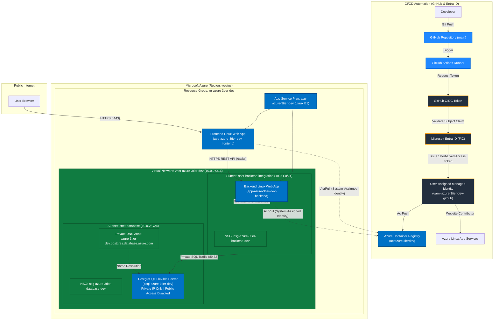
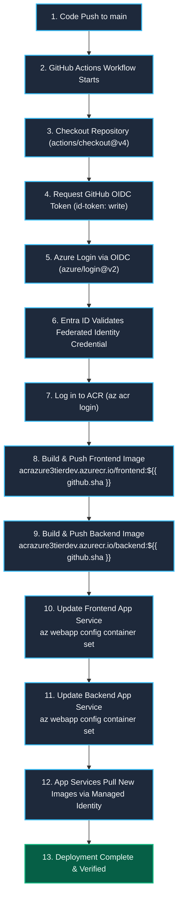
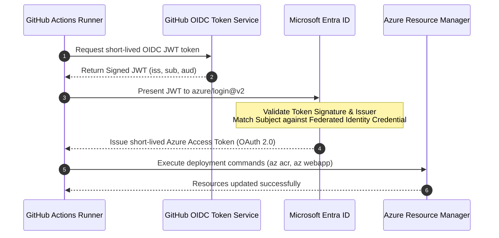

 Azure 3-Tier Task Management Application

A containerized three-tier web application provisioned and deployed on Microsoft Azure using Terraform, Docker, Azure Container Registry, Azure App Service, Azure Database for PostgreSQL Flexible Server, and GitHub Actions CI/CD with secure OpenID Connect (OIDC) workload identity federation.

---

## Project Overview

This project implements an end-to-end cloud-native task management application designed to reflect real-world enterprise Cloud and DevOps engineering practices. The architecture decouples the presentation, application logic, and persistence tiers into isolated, purpose-built cloud components.

```text
Frontend (Nginx / Web App)
            ↓
Backend REST API (Python Flask / Web App)
            ↓
Database (PostgreSQL Flexible Server)
```

From an operations and infrastructure perspective, the entire environment is automated and managed declaratively:

```text
Terraform (Infrastructure as Code)
            ↓
Azure Cloud Infrastructure (westus)

GitHub Repository (Push to main)
            ↓
GitHub Actions (CI/CD Pipeline)
            ↓
OpenID Connect (OIDC) → Microsoft Entra ID
            ↓
Azure Container Registry (ACR) & Azure App Services
```

### Logical Architecture

- **Presentation Tier:** A responsive single-page application built with HTML5, CSS3, and JavaScript, packaged in a lightweight Alpine Linux Nginx container and hosted on Azure Linux App Service.
- **Application Tier:** A RESTful API built with Python and Flask, using `psycopg` for connection handling and schema lifecycle management. Hosted on Azure Linux App Service with regional Virtual Network (VNet) integration.
- **Data Tier:** A fully managed Azure Database for PostgreSQL Flexible Server, provisioned inside a private delegated subnet with public network access disabled and private DNS zone resolution.

### DevOps & Engineering Highlights

- **Infrastructure as Code (IaC):** 100% of cloud resources (23 Azure resources) are defined, version-controlled, and managed through modular Terraform configurations.
- **Zero-Secret CI/CD Authentication:** GitHub Actions authenticates to Microsoft Azure using OpenID Connect (OIDC) and Microsoft Entra Workload Identity Federation, eliminating the risk of long-lived service principal passwords or stored client secrets.
- **Least-Privilege Role-Based Access Control (RBAC):** Scoped role assignments (`AcrPush`, `Website Contributor`, `AcrPull`) granted to dedicated Managed Identities.
- **Immutable Container Versioning:** Automated builds tag container images with the unique Git commit SHA (`${{ github.sha }}`) rather than relying on mutable `latest` tags.
- **Network Isolation:** Multi-subnet virtual network topology with Network Security Groups (NSGs) and native subnet delegations protecting backend and data tiers.

---

## Architecture Diagram



---

## Architecture Explanation

| Component | Resource Name / SKU | Purpose |
|---|---|---|
| **Resource Group** | `rg-azure-3tier-dev` | Logical lifecycle and management boundary for all project resources in `westus`. |
| **Virtual Network** | `vnet-azure-3tier-dev` (`10.0.0.0/16`) | Provides private network isolation and IP address space for cloud tiers. |
| **Backend Subnet** | `snet-backend-integration` (`10.0.1.0/24`) | Delegated to `Microsoft.Web/serverFarms` for App Service regional outbound routing. |
| **Database Subnet** | `snet-database` (`10.0.2.0/24`) | Delegated to `Microsoft.DBforPostgreSQL/flexibleServers` for private server NIC injection. |
| **Network Security Groups** | `nsg-azure-3tier-backend-dev`<br/>`nsg-azure-3tier-database-dev` | Enforces stateful network security rules at subnet perimeters. |
| **Private DNS Zone** | `azure-3tier-dev.postgres.database.azure.com` | Resolves private FQDN of the PostgreSQL database within the VNet without public DNS lookup. |
| **Container Registry** | `acrazure3tierdev` (Basic) | Centralized, secure storage for frontend and backend Docker images with admin credentials disabled. |
| **App Service Plan** | `asp-azure-3tier-dev` (Linux `B1`) | Dedicated Linux compute infrastructure hosting both containerized web applications. |
| **Frontend Web App** | `app-azure-3tier-dev-frontend` | Public-facing containerized Nginx instance serving HTML/CSS/JS over HTTPS. |
| **Backend Web App** | `app-azure-3tier-dev-backend` | Containerized Flask API with regional VNet integration to privately reach PostgreSQL. |
| **Database Server** | `psql-azure-3tier-dev` (`B_Standard_B1ms`) | Private PostgreSQL 16 server with 32 GB storage, automated backups, and disabled public access. |
| **CI/CD Managed Identity** | `uami-azure-3tier-dev-github` | User-Assigned Managed Identity used by GitHub Actions via OIDC federation. |
| **Federated Credentials** | `fic-azure-3tier-dev-github` | Establishes trust between GitHub OIDC token issuer and Microsoft Entra ID. |
| **IaC Automation** | Terraform (`>= 1.9.0`, AzureRM `~> 5.7`) | Automates creation, state tracking, and lifecycle management of all 23 Azure resources. |

---

## Key Features

- **Three-Tier Architectural Decoupling:** Complete separation of presentation, business logic, and database persistence layers.
- **Containerized Workloads:** Custom Docker images for frontend and backend ensuring cross-environment consistency.
- **Declarative Infrastructure as Code:** Fully automated provisioning using Terraform with modular `.tf` configurations and strict resource tagging.
- **Zero-Secret CI/CD with GitHub OIDC:** Automated deployments authenticated via Microsoft Entra Workload Identity Federation without storing passwords or client secrets in GitHub.
- **Private Database Networking:** PostgreSQL Flexible Server deployed with `public_network_access_enabled = false` and private DNS zone VNet resolution.
- **Regional VNet Integration:** Backend Web App configured with `vnet_route_all_enabled = true` into a dedicated delegated subnet (`Microsoft.Web/serverFarms`).
- **Least-Privilege Azure RBAC:** Identity-driven security utilizing `AcrPull`, `AcrPush`, and `Website Contributor` role definitions.
- **Admin-Disabled Registry Access:** Azure Container Registry admin user explicitly disabled; images pulled natively via App Service System-Assigned Managed Identities.
- **Immutable Container Versioning:** CI/CD pipeline builds and deploys images tagged with unique Git commit SHAs (`${{ github.sha }}`) to prevent deployment ambiguity.
- **Local Development Parity:** Full multi-container local development environment supported via `docker-compose.yml` with health check dependencies and volume persistence.

---

## Technology Stack

| Category | Technology | Purpose in Project |
|---|---|---|
| **Frontend** | HTML5, CSS3, JavaScript (Vanilla ES6), Nginx 1.27 (Alpine) | Single-page UI and static web server |
| **Backend API** | Python 3.12, Flask 3.0, Flask-CORS 4.0, psycopg 3.1 | REST API, CORS policy enforcement, PostgreSQL database driver |
| **Database** | PostgreSQL 16 (Flexible Server in Azure, Alpine in local Docker) | Relational data persistence for tasks |
| **Containerization** | Docker, Docker Compose | Application packaging, local orchestration, container runtime |
| **Cloud Platform** | Microsoft Azure (`westus` region) | Cloud infrastructure hosting |
| **Infrastructure as Code** | Terraform (`>= 1.9.0`, AzureRM `~> 5.7`) | Declarative infrastructure specification and lifecycle management |
| **CI/CD Automation** | GitHub Actions | Automated build, test, container publishing, and App Service deployment |
| **Identity & Authentication** | Microsoft Entra ID, GitHub OIDC, Azure RBAC | Workload Identity Federation, passwordless CI/CD, managed identities |
| **Container Registry** | Azure Container Registry (Basic SKU) | Private registry hosting container images |
| **Application Hosting** | Azure Linux App Service (Plan `B1`) | Managed Linux container runtime with regional VNet integration |
| **Networking** | Azure VNet, Subnet Delegations, NSGs, Private DNS | Network isolation, private database access, subnet segregation |
| **Version Control** | Git, GitHub | Source code management, version tracking, CI/CD event source |

---

## Azure Architecture

### Resource Group
All infrastructure components reside within `rg-azure-3tier-dev` in the `westus` region. The resource group provides a single lifecycle management, access control, and billing boundary. Every managed resource inherits standard tracking tags: `Project = azure-3tier`, `Environment = dev`, and `ManagedBy = Terraform`.

### Virtual Network & Subnet Topology
Network isolation is established via `vnet-azure-3tier-dev` configured with address space `10.0.0.0/16`. The network is segmented into two dedicated subnets:
1. **Backend Integration Subnet (`snet-backend-integration` - `10.0.1.0/24`):** Delegated specifically to `Microsoft.Web/serverFarms`. Enables the backend App Service to route outbound private traffic into the VNet.
2. **Database Subnet (`snet-database` - `10.0.2.0/24`):** Delegated exclusively to `Microsoft.DBforPostgreSQL/flexibleServers`. Injects the PostgreSQL network interface directly into the private VNet.

### Network Security Groups (NSGs)
Perimeter security is enforced using dedicated NSGs:
- `nsg-azure-3tier-backend-dev` associated with the backend integration subnet.
- `nsg-azure-3tier-database-dev` associated with the database subnet to restrict ingress traffic.

### Private DNS Resolution
To enable private communication without routing over the public internet:
- Azure Private DNS Zone `azure-3tier-dev.postgres.database.azure.com` was provisioned.
- The zone is linked to `vnet-azure-3tier-dev` via `azurerm_private_dns_zone_virtual_network_link.postgresql`.
- The backend application resolves the PostgreSQL host dynamically inside the VNet (`psql-azure-3tier-dev.postgres.database.azure.com`).

### Azure Container Registry (ACR)
Container images are hosted in `acrazure3tierdev.azurecr.io` (Basic SKU). For enhanced security:
- The registry admin user is explicitly disabled (`admin_enabled = false`).
- Push access is restricted to the GitHub Actions User-Assigned Managed Identity via the `AcrPush` role.
- Pull access is granted directly to the frontend and backend App Services via their System-Assigned Managed Identities using the `AcrPull` role.

### Azure App Service Plan & Web Apps
Compute is provided by a shared Linux App Service Plan (`asp-azure-3tier-dev`, SKU `B1`):
- **Frontend Web App (`app-azure-3tier-dev-frontend`):** Runs the containerized Nginx image. HTTPS-only traffic is enforced (`https_only = true`), TLS 1.2 minimum is mandated, and FTPS is disabled.
- **Backend Web App (`app-azure-3tier-dev-backend`):** Runs the containerized Flask image. Regional VNet integration is configured (`virtual_network_subnet_id = snet-backend-integration`), and all outbound traffic is routed through the virtual network (`vnet_route_all_enabled = true`). Database connection details are injected securely via App Settings.

### Azure Database for PostgreSQL Flexible Server
Data persistence is managed by `psql-azure-3tier-dev`:
- Engine version: PostgreSQL 16.
- Compute tier: Burstable `B_Standard_B1ms` with 32 GB auto-growing storage and 7-day backup retention.
- Zero public exposure: `public_network_access_enabled = false`. The database is reachable exclusively through its delegated private VNet interface.

---

## CI/CD Pipeline

The project employs an automated continuous deployment pipeline defined in [`.github/workflows/deploy.yml`](.github/workflows/deploy.yml). Every push to `main` (or manual `workflow_dispatch` trigger) runs an automated deployment without human intervention.



### Pipeline Execution Stages

1. **Trigger:** Event triggered automatically on `git push` to `main` or manually via `workflow_dispatch`.
2. **Runner Environment:** Executes on standard `ubuntu-latest` with OIDC permissions (`id-token: write`, `contents: read`).
3. **Repository Checkout:** Clones the latest commit using `actions/checkout@v4`.
4. **OIDC Authentication:** Authenticates with Microsoft Entra ID via `azure/login@v2` using the User-Assigned Managed Identity Client ID, Tenant ID, and Subscription ID without secrets.
5. **Registry Authentication:** Authenticates the runner against `acrazure3tierdev.azurecr.io` using the active Azure session (`az acr login`).
6. **Container Build & Tag:** Builds the frontend and backend Dockerfiles, tagging each image with the immutable Git commit SHA:
   - `acrazure3tierdev.azurecr.io/frontend:${{ github.sha }}`
   - `acrazure3tierdev.azurecr.io/backend:${{ github.sha }}`
7. **Registry Push:** Publishes both tagged container images to Azure Container Registry.
8. **App Service Rollout:** Instructs both Azure Web Apps to pull and run the newly pushed SHA-tagged containers:
   - `az webapp config container set --name app-azure-3tier-dev-frontend ...`
   - `az webapp config container set --name app-azure-3tier-dev-backend ...`
9. **Zero-Downtime Initialization:** App Services pull images via native Managed Identity role assignments and start updated containers.

---

## GitHub Actions → Azure OIDC Authentication

Traditional CI/CD pipelines require storing long-lived service principal client secrets or certificates inside repository secrets. This introduces notable security challenges:
- Secrets can expire, causing unexpected pipeline outages.
- Stored credentials risk leakage or exposure through misconfigured workflows.
- Secret rotation requires manual coordination across identity providers and CI/CD secret stores.

### Workload Identity Federation Flow

This project eliminates long-lived credentials entirely by configuring **OpenID Connect (OIDC)** and **Microsoft Entra Workload Identity Federation**:



### Technical Configuration

1. **Workflow Permissions:** The GitHub Actions workflow requests token-minting permissions:
   ```yaml
   permissions:
     id-token: write
     contents: read
   ```
2. **Azure Login Action:** Uses the official `azure/login@v2` action with only non-sensitive identifiers:
   ```yaml
   - name: Log in to Azure via OIDC
     uses: azure/login@v2
     with:
       client-id: ${{ secrets.AZURE_CLIENT_ID }}
       tenant-id: ${{ secrets.AZURE_TENANT_ID }}
       subscription-id: ${{ secrets.AZURE_SUBSCRIPTION_ID }}
   ```
3. **Federated Identity Credential Specification:**
   - **Issuer:** `https://token.actions.githubusercontent.com`
   - **Audience:** `api://AzureADTokenExchange`
   - **Subject:** `repo:Subhan032/azure-3tier:ref:refs/heads/main`
4. **Scoped RBAC Privileges:**
   - `AcrPush` scoped strictly to `acrazure3tierdev`
   - `Website Contributor` scoped strictly to the two Web App resource IDs

---

## Troubleshooting & Problem Solving

Documenting real-world engineering troubleshooting encountered during the infrastructure provisioning and deployment lifecycle demonstrates practical diagnostic ability and root-cause analysis.

---

### Incident 1 — GitHub Actions OIDC Authentication Failure

**Symptom**

During the initial execution of the automated CI/CD pipeline, the GitHub Actions runner failed at the `Log in to Azure via OIDC` step (`azure/login@v2`) with the following Entra ID error:

```text
AADSTS700213: No matching federated identity record found for presented assertion subject
```

The error log surfaced the incoming subject assertion:

```text
repo:Subhan032@167898089/azure-3tier@1407722208:ref:refs/heads/main
```

**Investigation**

The Federated Identity Credential (`azurerm_federated_identity_credential.github_actions`) was already provisioned in Terraform and attached to the User-Assigned Managed Identity, so the rejection was unexpected.

To determine why Entra ID rejected the token, the GitHub Actions runtime context was inspected on the runner by printing core environment variables:

```bash
echo "GITHUB_REPOSITORY=$GITHUB_REPOSITORY"
echo "GITHUB_REPOSITORY_OWNER=$GITHUB_REPOSITORY_OWNER"
echo "GITHUB_REPOSITORY_OWNER_ID=$GITHUB_REPOSITORY_OWNER_ID"
echo "GITHUB_REPOSITORY_ID=$GITHUB_REPOSITORY_ID"
echo "GITHUB_REF=$GITHUB_REF"
echo "GITHUB_EVENT_NAME=$GITHUB_EVENT_NAME"
```

The runner output confirmed the runtime values:

```text
Repository:          Subhan032/azure-3tier
Repository Owner:    Subhan032
Repository Owner ID: 167898089
Repository ID:       1407722208
Ref:                 refs/heads/main
Event:               push
```

Comparing these values with the Azure error revealed two factors:
1. The repository had been renamed from `azure-3tier-task-manager` to `azure-3tier`.
2. The incoming GitHub OIDC assertion token included internal GitHub numeric entity IDs (`Subhan032@167898089/azure-3tier@1407722208`).

**Root Cause**

Microsoft Entra ID validates the incoming JWT assertion against the `issuer`, `audience`, and `subject` configured in the Federated Identity Credential with byte-for-byte exactness. The initial Terraform configuration declared the subject strictly for the legacy repository name (`repo:Subhan032/azure-3tier-task-manager:ref:refs/heads/main`). Entra ID rejected the token because the presented assertion did not match the configured subject.

**Resolution**

Updated the Terraform configuration in [`terraform/locals.tf`](terraform/locals.tf) and [`terraform/github_actions.tf`](terraform/github_actions.tf) to:
1. Set the active repository subject (`repo:Subhan032/azure-3tier:ref:refs/heads/main`) as the primary credential.
2. Define a secondary federated credential for the legacy alias (`repo:Subhan032/azure-3tier-task-manager:ref:refs/heads/main`) to guarantee compatibility across branch and remote aliases.

```hcl
resource "azurerm_federated_identity_credential" "github_actions" {
  name                      = local.github_actions_federated_credential_name
  user_assigned_identity_id = azurerm_user_assigned_identity.github_actions.id
  issuer                    = "https://token.actions.githubusercontent.com"
  audience                  = ["api://AzureADTokenExchange"]
  subject                   = "repo:${local.github_repository}:ref:refs/heads/${local.github_default_branch}"
}
```

**Verification**

Re-running the GitHub Actions pipeline resulted in an immediate successful login via `azure/login@v2`, followed by successful ACR login, container image building, pushing, and App Service deployment.

**Lesson Learned**

OIDC troubleshooting requires comparing the actual runtime token identity against the Federated Identity Credential rather than assuming that the credential's presence guarantees correct configuration. Every segment of the assertion claim must align precisely with the provider's token generation rules.

---

### Incident 2 — Regional App Service Compute Quota Depletion in West US

**Symptom**

During the initial `terraform apply`, foundational networking, database, registry, and identity resources were provisioned successfully. However, the App Service Plan creation (`azurerm_service_plan.main`) abruptly failed:

```text
Error: creating Service Plan (Subscription: "..." Resource Group: "rg-azure-3tier-dev" Service Plan: "asp-azure-3tier-dev"): 
server returned an error: 401 Unauthorized
Code: Unauthorized
ExtendedCode: 70007
Message: "Operation cannot be completed without additional quota.
Additional details - Location: 
Current Limit (Total VMs): 0
Current Usage: 0
Amount required for this deployment (Total VMs): 1
(Minimum) New Limit that you should request to enable this deployment: 1."
```

**Investigation**

Although the HTTP status code was reported as `401 Unauthorized`, inspecting the detailed ARM payload revealed `ExtendedCode: 70007` and `Current Limit (Total VMs): 0`. Rather than assuming an IAM permissions issue, subscription quota limits for Linux App Service Basic compute in `westus` were examined directly in the Azure Portal (**Subscriptions > Usage + quotas**).

**Root Cause**

Azure subscriptions (particularly developer, trial, or newly provisioned pay-as-you-go subscriptions) default to a quota limit of `0` allocated compute cores/VMs for Basic App Service tiers in select regions such as `westus` until explicitly increased.

**Resolution**

Rather than modifying Terraform code, downgrading to unsupported tiers (the Free `F1` tier does not support custom containers or VNet integration), or switching regions away from the strict `westus` requirement, a quota increase request for 1 B1 VM in West US was submitted through the Azure Portal. Once Microsoft Support approved the quota increase, `terraform apply` was re-executed without changing a single line of infrastructure code.

**Verification**

The resumed `terraform apply` completed cleanly: adding the App Service Plan, both Web Apps, and all four RBAC role assignments, achieving 23 synchronized Azure resources.

**Lesson Learned**

Cloud providers often surface capacity, entitlement, or quota restrictions under generic HTTP status codes (such as 401 or 403). Engineers must inspect the inner error payload (`ExtendedCode`, diagnostic messages) before prematurely modifying infrastructure configurations.

---

### Incident 3 — Database Subnet Service Endpoint Configuration Drift

**Symptom**

During Terraform planning phases, `terraform plan` consistently proposed an in-place modification (`~`) on `azurerm_subnet.database`:

```hcl
~ resource "azurerm_subnet" "database" {
    - service_endpoint {
        - service = "Microsoft.Storage" -> null
      }
  }
Plan: 0 to add, 1 to change, 0 to destroy.
```

**Investigation**

Examining the project's git history showed that during initial networking scaffolding, `snet-database` was provisioned with a service endpoint for `Microsoft.Storage`. Subsequently, the database tier was implemented using Azure Database for PostgreSQL Flexible Server, which utilizes native private virtual network integration via delegated subnets (`Microsoft.DBforPostgreSQL/flexibleServers`) and does not require storage service endpoints.

**Root Cause**

The live Azure subnet resource retained the `Microsoft.Storage` service endpoint from the initial networking deployment, while the updated code in `network.tf` had removed the `service_endpoints` block, resulting in persistent configuration drift.

**Resolution**

Careful review confirmed that removing the unused service endpoint was an in-place update (`~`) rather than a destructive subnet recreation (`-/+`). Terraform safely applied the modification in 11 seconds, reconciling the live state without breaking subnet delegation or disrupting the private PostgreSQL instance.

**Verification**

Subsequent `terraform plan` executions reported: `No changes. Your infrastructure matches the configuration.`

**Lesson Learned**

Distinguishing between in-place modifications (`~`) and destructive replacements (`-/+`) in Terraform plan outputs is critical. Understanding resource lifecycles and subnet delegation mechanics avoids unnecessary teardowns of stateful database infrastructure.

---

### Incident 4 — Flask Debug Mode Active in Containerized Cloud Deployment

**Symptom**

During a pre-deployment security audit, inspecting [`backend/app.py`](backend/app.py) revealed:

```python
if __name__ == "__main__":
    init_db()
    app.run(host="0.0.0.0", port=5000, debug=True)
```

**Investigation**

The configuration was evaluated for cloud container readiness. In Flask, `debug=True` enables the interactive Werkzeug browser debugger, alters stack trace output, and keeps an active file-system watcher in memory. Running interactive debuggers inside cloud containers exposes unnecessary diagnostic endpoints and risks unhandled exception behavior.

**Root Cause**

Initial development defaults established during early local testing remained in the application entrypoint when containerization and cloud infrastructure were introduced.

**Resolution**

Updated [`backend/app.py`](backend/app.py) to explicitly enforce `debug=False`:

```python
if __name__ == "__main__":
    init_db()
    app.run(host="0.0.0.0", port=5000, debug=False)
```

**Verification**

Rebuilt the backend container image locally with Docker Compose, validated that `0.0.0.0:5000` port bindings and full CRUD functionality operated normally, and confirmed that the production container was hardened prior to triggering cloud deployments.

**Lesson Learned**

Local development conveniences must never carry over into cloud container deployments. Formal pre-deployment audit checkpoints ensure that debuggers, default credentials, and verbose logging modes are sanitized prior to CI/CD automation.

---

## Problem-Solving Approach

Throughout the design, provisioning, and deployment of this project, technical hurdles were approached using a disciplined, structured troubleshooting methodology:

```text
Observe
   ↓
Reproduce
   ↓
Collect logs / error messages
   ↓
Inspect configuration
   ↓
Compare expected vs actual behavior
   ↓
Identify root cause
   ↓
Apply targeted fix
   ↓
Re-run deployment
   ↓
Verify end-to-end behavior
```

Rather than guessing at solutions or making arbitrary configuration changes until a build passes, each problem was treated as an opportunity to understand the underlying cloud mechanism—whether Entra ID token claims, ARM compute quota limits, Terraform state reconciliation, or container runtime isolation. This principled approach ensured that fixes were targeted, minimal, and fully documented.

---

## Infrastructure as Code

The entire cloud infrastructure is defined declaratively using Terraform, targeting the `azurerm` provider (`~> 5.7`) with Terraform `>= 1.9.0`.

### Terraform File Structure

```text
terraform/
├── main.tf              # Resource Group declaration
├── providers.tf         # AzureRM provider configuration
├── terraform.tf         # Terraform binary and provider version constraints
├── variables.tf         # Input variable definitions (regions, SKUs, CIDR blocks)
├── locals.tf            # Consistent naming conventions, tags, repository metadata
├── network.tf           # Virtual Network, delegated subnets, NSGs, and associations
├── postgresql.tf        # Private DNS zone, VNet link, PostgreSQL Flexible Server, database
├── acr.tf               # Azure Container Registry (Basic SKU, admin disabled)
├── app_service.tf       # Linux App Service Plan, Web Apps, managed identity role assignments
├── github_actions.tf    # User-Assigned Managed Identity, Federated Identity Credentials, RBAC
└── outputs.tf           # Infrastructure outputs (endpoints, resource IDs, identity Client ID)
```

### Core Terraform Commands

```bash
# 1. Initialize Terraform working directory and install providers
terraform -chdir=terraform init

# 2. Validate syntax and configuration integrity
terraform -chdir=terraform validate

# 3. Format configuration files to standard style
terraform -chdir=terraform fmt

# 4. Generate and inspect an execution plan
terraform -chdir=terraform plan

# 5. Apply the plan to provision infrastructure
terraform -chdir=terraform apply
```

### Infrastructure Management Benefits

- **Consistency:** Eliminates configuration drift and manual Azure Portal errors.
- **Modularity:** Isolated configuration files separate networking, compute, data, and identity concerns.
- **Auditability:** Every infrastructure modification is tracked via Git commits and version control.
- **Reproducibility:** The entire multi-tier environment can be provisioned or destroyed systematically.

---

## Docker & Containerization

Docker packages the application components into portable, immutable runtime environments.

### Frontend Container (`frontend/Dockerfile`)

```dockerfile
FROM nginx:alpine

# Copy static frontend files to Nginx public root
COPY index.html style.css app.js /usr/share/nginx/html/

# Copy custom Nginx routing configuration
COPY nginx.conf /etc/nginx/conf.d/default.conf

EXPOSE 80

CMD ["nginx", "-g", "daemon off;"]
```

### Backend Container (`backend/Dockerfile`)

```dockerfile
FROM python:3.12-slim

WORKDIR /app

ENV PYTHONUNBUFFERED=1

COPY requirements.txt .
RUN pip install --no-cache-dir -r requirements.txt

COPY . .

EXPOSE 5000

CMD ["python", "app.py"]
```

### Containerization Practices

- **Immutable Image Tagging:** Images published to Azure Container Registry are tagged with the Git commit SHA (`${{ github.sha }}`). This provides an auditable 1-to-1 mapping between running containers and the Git commit history, avoiding the unpredictability of mutable `latest` tags.
- **Local Multi-Container Orchestration:** A top-level `docker-compose.yml` provides identical service relationships locally:
  - Frontend accessible on `http://localhost:8080`.
  - Backend accessible on `http://localhost:5000`.
  - PostgreSQL container (`postgres:16-alpine`) on port `5432` with a persistent named volume (`postgres_data`) and an automated health check (`pg_isready`).

---

## Repository Structure

```text
azure-3tier/
├── .github/
│   └── workflows/
│       └── deploy.yml              # GitHub Actions CI/CD deployment pipeline
├── backend/
│   ├── app.py                      # Flask REST API implementation and DB queries
│   ├── Dockerfile                  # Python 3.12 container specification
│   └── requirements.txt            # Python dependencies (Flask, Flask-CORS, psycopg)
├── frontend/
│   ├── app.js                      # Vanilla JavaScript UI logic and API client
│   ├── Dockerfile                  # Nginx Alpine container specification
│   ├── index.html                  # Responsive UI layout and DOM elements
│   ├── nginx.conf                  # Nginx web server configuration
│   └── style.css                   # Custom UI styling and responsive design
├── terraform/
│   ├── acr.tf                      # Azure Container Registry
│   ├── app_service.tf              # Linux App Service Plan, Web Apps, AcrPull RBAC
│   ├── github_actions.tf           # Managed Identity, Federated Credentials, CI/CD RBAC
│   ├── locals.tf                   # Naming conventions, tags, resource references
│   ├── main.tf                     # Resource Group declaration
│   ├── network.tf                  # VNet, delegated subnets, NSGs, and associations
│   ├── outputs.tf                  # Exported outputs and resource identifiers
│   ├── postgresql.tf               # PostgreSQL Flexible Server, Private DNS, Database
│   ├── providers.tf                # AzureRM provider block
│   ├── terraform.tf                # Terraform version constraints
│   └── variables.tf                # Input variable declarations
├── .env.example                    # Template environment variables for local Docker Compose
├── docker-compose.yml              # Local multi-container development orchestration
├── .gitignore                      # Git ignore patterns for Terraform, Python, and environments
└── README.md                       # Comprehensive Cloud/DevOps project documentation
```

---

## Deployment Guide

### Prerequisites

- [Azure CLI](https://learn.microsoft.com/en-us/cli/azure/install-azure-cli) (`az`) installed and authenticated (`az login`)
- [Terraform](https://developer.hashicorp.com/terraform/downloads) (`>= 1.9.0`)
- [Docker](https://docs.docker.com/get-docker/) and [Docker Compose](https://docs.docker.com/compose/)
- Active Azure Subscription with Owner or User Access Administrator + Contributor permissions
- GitHub account and repository access

---

### Step 1: Local Development & Validation

Before deploying to the cloud, validate the application locally using Docker Compose:

```bash
# 1. Clone repository
git clone https://github.com/Subhan032/azure-3tier.git
cd azure-3tier

# 2. Copy environment template
cp .env.example .env

# 3. Start local multi-container stack
docker compose up -d --build

# 4. Verify running containers
docker compose ps

# 5. Access the application
# Frontend: http://localhost:8080
# Backend API: http://localhost:5000/
```

---

### Step 2: Provision Cloud Infrastructure with Terraform

```bash
# 1. Navigate to Terraform directory
cd terraform

# 2. Initialize provider plugins
terraform init

# 3. Validate configuration
terraform validate

# 4. Plan deployment (provide password via TF_VAR or prompt)
export TF_VAR_postgres_admin_password="<your-secure-password>"
terraform plan -out=tfplan

# 5. Apply infrastructure plan
terraform apply tfplan

# 6. Capture outputs for GitHub Actions
terraform output
```

---

### Step 3: Configure GitHub Actions Secrets

In your GitHub repository, navigate to **Settings > Secrets and variables > Actions** and add the following repository secrets using the values emitted by `terraform output`:

| Secret Name | Value Description |
|---|---|
| `AZURE_CLIENT_ID` | `github_actions_client_id` (User-Assigned Managed Identity Client ID) |
| `AZURE_TENANT_ID` | `github_actions_tenant_id` (Azure Entra ID Tenant ID) |
| `AZURE_SUBSCRIPTION_ID` | Your Azure Subscription ID |

---

### Step 4: Trigger Automated Deployment

Push code to the `main` branch to trigger the automated CI/CD pipeline:

```bash
git add .
git commit -m "feat: trigger automated deployment to Azure"
git push origin main
```

Navigate to the **Actions** tab in GitHub to observe the pipeline build containers, push to ACR, and update Azure App Services via OIDC.

---

## Security Considerations

### Implemented Controls

- **Zero-Secret CI/CD (OIDC):** Workload Identity Federation replaces stored Azure service principal credentials with short-lived cryptographic JWT assertions.
- **Least-Privilege RBAC:** The GitHub Actions identity is granted only `AcrPush` on ACR and `Website Contributor` on App Services.
- **Admin User Disabled on ACR:** Direct registry logins via admin credentials are deactivated; App Services pull container images via native System-Assigned Managed Identities (`AcrPull`).
- **Private Database Perimeter:** PostgreSQL Flexible Server disables public network ingress (`public_network_access_enabled = false`) and relies exclusively on a delegated private VNet subnet.
- **Private DNS Resolution:** Database hostnames resolve privately inside the virtual network using Azure Private DNS Zones.
- **Encrypted Web Traffic:** App Services enforce HTTPS-only routing (`https_only = true`), mandate TLS 1.2 minimum, and disable FTPS.
- **Safe Database Authentication:** PostgreSQL utilizes SCRAM-SHA-256 password hashing.

### Recommended Production Improvements

- **Azure Key Vault:** Store database credentials and application configuration in Key Vault with Key Vault References in App Service.
- **Private Endpoints:** Replace App Service public endpoints with Azure Private Endpoints behind an Azure Application Gateway or Azure Front Door.
- **Container Vulnerability Scanning:** Integrate Trivy or Microsoft Defender for Cloud into the CI/CD pipeline to scan Docker images before publishing.
- **Network Segmentation:** Implement egress firewalls (Azure Firewall or NAT Gateway) to strictly govern outbound internet access from App Services.

---

## Production Readiness & Improvements

This project serves as a functional cloud and DevOps portfolio deployment. The table below illustrates the architectural differences between this baseline implementation and a production-grade enterprise deployment:

| Architectural Area | Current Implementation | Production-Grade Improvement |
|---|---|---|
| **Secret Management** | Injected via App Settings & Terraform variables | Azure Key Vault with App Service Managed Identity Key Vault References |
| **Database Availability** | Single-node PostgreSQL Flexible Server (`B1ms`) | Zone-redundant High Availability (HA) with automatic failover standby |
| **Database Backups** | 7-day automated backups | Geo-redundant backup storage (GRS) with point-in-time recovery (PITR) |
| **Network Perimeter** | Public App Service with private VNet backend integration | Azure Private Endpoints for both Web Apps behind Azure Application Gateway with WAF |
| **Monitoring & Metrics** | Standard Azure App Service diagnostic logs | Azure Monitor, Log Analytics workspace, and Application Insights APM tracing |
| **Centralized Logging** | Local Docker logging & container std-out | Centralized log ingestion via Azure Monitor / Log Analytics with alerting rules |
| **CI/CD Governance** | Direct deployment on push to `main` | Multi-stage pipeline (dev → staging → prod) with manual approval gates |
| **Terraform State** | Local state file | Remote state in Azure Blob Storage with state locking via Azure Blob leasing |
| **Container Scanning** | Build and push without security scanning | Automated image vulnerability scanning (Trivy / Defender for Containers) in CI/CD |
| **Compute Scaling** | Single B1 instance | Auto-scaling rules based on CPU/Memory thresholds and multi-zone distribution |
| **Custom DNS & TLS** | Default `*.azurewebsites.net` domains with Azure certs | Custom corporate domain with Azure Managed Certificates or Key Vault TLS certs |
| **Disaster Recovery** | Single region (`westus`) | Multi-region deployment with Azure Traffic Manager or Azure Front Door |

---

## Key Takeaways

This project demonstrates practical competence across core Cloud and DevOps disciplines:

1. **Enterprise Cloud Architecture:** Designing decoupled, secure multi-tier architectures using Azure native services.
2. **Infrastructure as Code (IaC):** Structuring maintainable, modular, and parameterized Terraform code to manage multi-resource environments.
3. **Modern Identity & Security:** Implementing passwordless CI/CD authentication via OpenID Connect and Microsoft Entra ID Workload Identity Federation.
4. **Containerization & Orchestration:** Building standards-compliant Docker images, optimizing layer caching, and maintaining local-to-cloud parity.
5. **Continuous Integration & Continuous Delivery (CI/CD):** Writing automated, event-driven pipelines in GitHub Actions with immutable image versioning.
6. **Network Engineering in Azure:** Implementing virtual networks, custom subnet delegations, private DNS zones, and network security groups.
7. **Disciplined Troubleshooting:** Performing root-cause analysis on complex cloud errors (token subject claims, ARM compute quota limits, configuration drift).

---

## Challenges & Lessons Learned

- **Precision in OIDC Subject Matching:** The presence of a Federated Identity Credential is not enough to grant access. Microsoft Entra ID requires exact character-level alignment across token claims (`issuer`, `subject`, `audience`). Debugging runner environment variables proved essential to resolving assertion mismatches.
- **Interpreting Cloud Provider Error Payloads:** Cloud platforms occasionally surface resource quota exhaustion under generic HTTP error codes (e.g., `401 Unauthorized`). Looking past the top-level HTTP code into the inner diagnostic payload (`ExtendedCode: 70007`) prevents false assumptions about permissions.
- **In-Place Updates vs. Destructive Re-creation in IaC:** Analyzing Terraform execution plans (`~` in-place vs. `-/+` replacement) is critical when modifying network configurations to avoid dropping stateful database connections.
- **Sanitizing Local Defaults for Cloud Containers:** Configuration convenient for local debugging (`debug=True` in Flask) can create security and stability risks when containerized. Rigorous pre-deployment audits prevent development shortcuts from reaching the cloud.

---

## Future Enhancements

- [ ] Migrate Terraform state to a remote Azure Storage Account backend with state locking.
- [ ] Integrate Azure Key Vault to eliminate environment variable database passwords.
- [ ] Implement Application Insights for distributed request tracing and latency monitoring.
- [ ] Deploy Azure Application Gateway with Web Application Firewall (WAF) v2 in front of the presentation tier.
- [ ] Implement multi-environment GitHub Actions workflows (`staging` and `production`) with environment protection rules.
- [ ] Add automated container image vulnerability scanning with Trivy in the CI/CD pipeline.
- [ ] Configure zone-redundant high availability for PostgreSQL Flexible Server.

---

## Portfolio Summary

This project demonstrates practical experience designing, provisioning, containerizing, securing, troubleshooting, and deploying a cloud application on Microsoft Azure using modern Infrastructure as Code and DevOps practices. By combining Terraform, Docker, Azure App Service, private PostgreSQL networking, and GitHub Actions with passwordless OIDC authentication, the project highlights a strong foundation in cloud engineering, security automation, and infrastructure lifecycle management.


